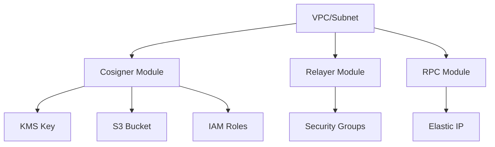

# Infrastructure Documentation - AWS Terraform Fireblocks Cosigner

## Table of Contents
1. [Overview](#overview)
2. [Architecture Components](#architecture-components)
3. [Cosigner Module](#cosigner-module)
4. [Relayer Module](#relayer-module)
5. [RPC Module](#rpc-module)
6. [Security Architecture](#security-architecture)
7. [Networking Configuration](#networking-configuration)
8. [IAM and Access Control](#iam-and-access-control)
9. [Data Storage and Encryption](#data-storage-and-encryption)
10. [Deployment Requirements](#deployment-requirements)

## Overview

This infrastructure repository implements a secure, multi-tier architecture for Fireblocks MPC (Multi-Party Computation) cosigner operations on AWS using Terraform. The system consists of three primary modules: Cosigner (Nitro Enclave-based), Relayer, and RPC nodes, each serving distinct roles in the cryptographic signing and blockchain interaction workflow.

### Key Technologies
- **Terraform**: Infrastructure as Code (IaC) tool, version ~5.0 AWS provider
- **AWS Nitro Enclaves**: Isolated compute environments for secure key operations
- **Fireblocks MPC**: Multi-party computation for distributed key management
- **KMS**: AWS Key Management Service for encryption key management
- **S3**: Object storage for secure data persistence

## Architecture Components

### Module Structure
```
.
├── cosigner/          # Nitro Enclave-based MPC cosigner infrastructure
│   ├── ec2.tf        # EC2 instance with Nitro Enclave capabilities
│   ├── iam.tf        # IAM roles and policies for secure access
│   ├── kms.tf        # KMS key for encryption
│   ├── s3.tf         # S3 bucket for storage
│   ├── sg.tf         # Security group configurations
│   ├── main.tf       # Provider configuration
│   ├── variables.tf  # Input variables
│   └── output.tf     # Output values
├── relayer/          # Relay server infrastructure
│   ├── ec2.tf        # EC2 instance configuration
│   ├── sg.tf         # Security group settings
│   ├── main.tf       # Provider configuration
│   └── variables.tf  # Input variables
└── rpc/              # RPC node infrastructure
    ├── ec2.tf        # EC2 instance configuration
    ├── eip.tf        # Elastic IP allocation
    ├── sg.tf         # Security group settings
    ├── main.tf       # Provider configuration
    ├── variables.tf  # Input variables
    └── output.tf     # Output values
```

## Cosigner Module

### Purpose
The Cosigner module deploys a hardened, Nitro Enclave-enabled EC2 instance for secure MPC key operations. This component handles cryptographic signing operations in an isolated, attestable environment.

### EC2 Configuration (cosigner/ec2.tf)

#### Instance Specifications
- **Instance Type**: `c5.xlarge` (4 vCPUs, 8 GiB RAM)
- **AMI Selection**: Amazon Linux 2023 (latest version via data source)
  - Filters: HVM virtualization, x86_64 architecture, EBS root device
  - Pattern: `al2023-ami-*-x86_64`
- **Instance Name**: `nitro-mainnet-01`

#### Nitro Enclave Configuration
```hcl
enclave_options {
  enabled = true
}
```
- Enables AWS Nitro Enclaves for isolated compute environments
- Provides CPU and memory isolation from parent instance
- Enables cryptographic attestation capabilities

#### Storage Configuration
- **Root Volume**: 100 GB GP3 SSD
- **Delete on Termination**: Enabled
- **IOPS**: Default GP3 (3000 IOPS baseline)
- **Throughput**: Default GP3 (125 MB/s)

#### Metadata Service Configuration
```hcl
metadata_options {
  http_tokens               = "required"    # IMDSv2 enforcement
  http_put_response_hop_limit = 2
  http_endpoint             = "enabled"
}
```

### IAM Configuration (cosigner/iam.tf)

#### EC2 Instance Role
- **Role Name**: `nitro-mainnet-ec2-role-{random_suffix}`
- **Trust Policy**: Allows EC2 service to assume role
- **Instance Profile**: `nitro-mainnet-ec2-role-profile-{random_suffix}`

#### Inline Policy Permissions
1. **S3 Permissions**:
   - `s3:ListAllMyBuckets` (global)
   - `s3:ListBucket`, `s3:GetBucketLocation` on specific bucket
   - Full object operations (`Put`, `Get`, `Delete`, `ACL`) on bucket objects

2. **KMS Permissions**:
   - `kms:Encrypt`, `kms:Decrypt`
   - `kms:GenerateDataKey`, `kms:GenerateDataKeyPair`
   - `kms:GenerateDataKeyWithoutPlaintext`
   - `kms:GenerateDataKeyPairWithoutPlaintext`
   - `kms:GenerateRandom`
   - `kms:GetKeyPolicy`

3. **Attached Managed Policy**:
   - `AmazonSSMManagedInstanceCore` for Systems Manager access

### KMS Configuration (cosigner/kms.tf)

#### KMS Key Specifications
- **Description**: "Customer Managed Key for MPC keyshares"
- **Key Usage**: `ENCRYPT_DECRYPT`
- **Key Spec**: `SYMMETRIC_DEFAULT` (AES-256)
- **Status**: Enabled

#### KMS Key Policy
1. **Root Account Access**:
   - Full KMS permissions for AWS account root
   - Enables key administration

2. **Enclave-Specific Access**:
   - Conditional access based on PCR8 attestation
   - PCR8 Value: `da1d9eca20ce98ab4fdbc51f8e5a2307fd4c61829b7d8bff40976cd6676862c8f3476ff4bdd0f65ecf4a48d6eb3099a8`
   - This ensures only attested enclaves can perform cryptographic operations

3. **GetKeyPolicy Permission**:
   - Allows cosigner role to retrieve key policy

### S3 Configuration (cosigner/s3.tf)

#### Bucket Configuration
- **Bucket Name**: `nitro-mainnet-bucket-{random_suffix}`
- **Versioning**: Not explicitly configured (defaults to disabled)
- **Encryption**: Server-side encryption with KMS key

#### Bucket Policy
- **Type**: Deny-by-default with exception
- **Allowed Principal**: Only the Nitro EC2 instance role
- **Denied Actions**: All S3 operations for unauthorized principals
- **Protection Level**: Prevents accidental or unauthorized access

### Security Group Configuration (cosigner/sg.tf)

#### Inbound Rules
| Port  | Protocol | Source CIDR        | Purpose                    |
|-------|----------|-------------------|----------------------------|
| 8080  | TCP      | 12.0.0.0/16       | HTTP API endpoint          |
| 4001  | TCP      | 12.0.0.0/16       | Internal service port      |
| 50051 | TCP      | 12.0.0.0/16       | gRPC service endpoint      |

#### Outbound Rules
- **All Traffic**: 0.0.0.0/0 (unrestricted egress)

### Outputs (cosigner/output.tf)
- `instance_ip`: Private IP address of Nitro instance
- `kms_id_01`: KMS key ID
- `ami_id`: Used AMI ID
- `ami_name`: AMI name
- `iam_role_name`: Created IAM role name
- `iam_instance_profile_name`: Instance profile name
- `s3_bucket_name`: Created S3 bucket name

## Relayer Module

### Purpose
The Relayer module provides intermediate communication services between the cosigner and blockchain networks, handling message relay and protocol translation.

### EC2 Configuration (relayer/ec2.tf)

#### Instance Specifications
- **Instance Type**: `c5.large` (2 vCPUs, 4 GiB RAM)
- **AMI**: Ubuntu 22.04 LTS (Jammy)
  - Owner: Canonical (099720109477)
  - Pattern: `ubuntu/images/hvm-ssd/ubuntu-jammy-22.04-amd64-server-*`
- **Instance Name**: `relayer-server-mainnet-0`

#### Storage Configuration
- **Root Volume**: 100 GB GP3 SSD
- **EBS Optimized**: Disabled
- **Source/Dest Check**: Enabled

#### Instance Profile
- Uses pre-existing `AmazonSSMRoleForInstancesQuickSetup` profile
- Provides Systems Manager connectivity

### Security Group Configuration (relayer/sg.tf)

#### Inbound Rules
| Port  | Protocol | Source CIDR        | Purpose                         |
|-------|----------|-------------------|----------------------------------|
| 8080  | TCP      | 12.0.0.0/16       | HTTP API endpoint                |
| 4001  | TCP      | 12.0.0.0/16       | P2P communication (TCP)          |
| 4001  | UDP      | 12.0.0.0/16       | P2P communication (UDP)          |
| 9009  | TCP      | 12.0.0.0/16       | Monitoring/metrics endpoint (TCP)|
| 9009  | UDP      | 12.0.0.0/16       | Monitoring/metrics endpoint (UDP)|

#### Outbound Rules
- **All Traffic**: 0.0.0.0/0 (unrestricted egress)

## RPC Module

### Purpose
The RPC module deploys blockchain RPC nodes that provide direct blockchain interaction capabilities, supporting both Ethereum execution layer and consensus layer protocols.

### EC2 Configuration (rpc/ec2.tf)

#### Instance Specifications
- **Instance Type**: `c5.2xlarge` (8 vCPUs, 16 GiB RAM)
- **AMI**: Ubuntu 22.04 LTS (same as Relayer)
- **Instance Name**: `rpc-goat`

#### Storage Configuration
- **Root Volume**: 100 GB GP3 SSD
- **EBS Optimized**: Disabled

### Elastic IP Configuration (rpc/eip.tf)

#### EIP Allocation
- **Domain**: VPC
- **Association**: Attached to `rpc-goat` instance
- **Purpose**: Provides stable public IP for external RPC access

#### EIP Association Resource
- Links EIP allocation to EC2 instance
- Enables automatic reassociation on instance replacement

### Security Group Configuration (rpc/sg.tf)

#### Inbound Rules
| Port   | Protocol | Source CIDR | Purpose                           |
|--------|----------|------------|-----------------------------------|
| 30303  | TCP      | 0.0.0.0/0  | Geth P2P communication (TCP)      |
| 30303  | UDP      | 0.0.0.0/0  | Geth P2P discovery (UDP)          |
| 26656  | TCP      | 0.0.0.0/0  | Tendermint consensus P2P          |

#### Outbound Rules
- **All Traffic**: 0.0.0.0/0 (unrestricted egress)

### Outputs (rpc/output.tf)
- `instance_ip_goat`: Public IP address via Elastic IP

## Security Architecture

### Defense in Depth Strategy

#### Layer 1: Network Isolation
- VPC-based deployment with subnet segmentation
- Security groups with principle of least privilege
- Internal CIDR blocks (12.0.0.0/16) for service communication

#### Layer 2: Compute Isolation
- AWS Nitro Enclaves for cryptographic operations
- PCR-based attestation for enclave verification
- Isolated CPU and memory allocation

#### Layer 3: Access Control
- IAM roles with minimal required permissions
- Instance profiles for EC2 service authentication
- S3 bucket policies with explicit deny rules

#### Layer 4: Data Protection
- KMS encryption for data at rest
- Enclave-based key operations
- Attestation-gated KMS access

### Cryptographic Attestation

#### PCR8 Verification
The PCR8 (Platform Configuration Register 8) value ensures:
- Only authorized enclave images can access KMS keys
- Runtime integrity verification
- Protection against unauthorized modifications

#### Attestation Flow
1. Enclave generates attestation document
2. KMS validates PCR8 value against policy
3. Cryptographic operations allowed if validation succeeds

## Networking Configuration

### Network Topology

#### Subnet Architecture
- All instances deployed in specified subnet (`subnet_id` variable)
- Internal communication via private IPs
- RPC node has public IP via Elastic IP

#### Port Allocation Strategy

##### Internal Services (12.0.0.0/16)
- **8080/TCP**: HTTP API endpoints (all modules)
- **4001/TCP+UDP**: P2P communication (cosigner, relayer)
- **50051/TCP**: gRPC services (cosigner)
- **9009/TCP+UDP**: Monitoring (relayer)

##### Public Services (0.0.0.0/0)
- **30303/TCP+UDP**: Ethereum P2P (RPC)
- **26656/TCP**: Consensus layer P2P (RPC)

### Traffic Flow Patterns

#### Inbound Flow
1. External requests → RPC node (public IP)
2. RPC node → Relayer (internal network)
3. Relayer → Cosigner (internal network)
4. Cosigner performs cryptographic operations

#### Outbound Flow
- All instances have unrestricted egress
- Enables software updates and external API calls
- Blockchain network synchronization

## IAM and Access Control

### Role-Based Access Control (RBAC)

#### Cosigner Role Permissions
```
nitro-mainnet-ec2-role-{suffix}
├── S3 Access
│   ├── Bucket listing
│   ├── Object operations
│   └── ACL management
├── KMS Access
│   ├── Encryption/Decryption
│   ├── Data key generation
│   └── Policy retrieval
└── SSM Access (managed policy)
```

#### Relayer/RPC Roles
- Utilizes pre-configured `AmazonSSMRoleForInstancesQuickSetup`
- Provides Systems Manager access for remote management
- No additional custom permissions

### Service Account Security

#### EC2 Service Principal
- Trust relationship limited to EC2 service
- No cross-account assumptions
- Time-bound credentials via STS

#### Policy Attachment Methods
1. **Inline Policies**: Custom permissions specific to role
2. **Managed Policies**: AWS-maintained policies (SSM)
3. **Resource Policies**: S3 bucket and KMS key policies

## Data Storage and Encryption

### S3 Storage Architecture

#### Bucket Structure
```
nitro-mainnet-bucket-{suffix}/
├── keyshares/           # MPC key fragments
├── attestation/         # Enclave attestation documents
└── audit/               # Operation logs
```

#### Access Patterns
- **Write**: Only from Nitro EC2 instance
- **Read**: Only from Nitro EC2 instance
- **Delete**: Restricted to specific objects
- **List**: Allowed for navigation

### KMS Encryption Framework

#### Key Hierarchy
1. **Customer Master Key (CMK)**: Root encryption key
2. **Data Encryption Keys (DEK)**: Generated per-object
3. **Enclave Keys**: Ephemeral keys within Nitro Enclave

#### Encryption Operations
- **GenerateDataKey**: Creates new DEKs
- **Encrypt/Decrypt**: Direct data operations
- **GenerateRandom**: Cryptographic randomness

### Data Lifecycle Management

#### Retention Policies
- No explicit lifecycle rules configured
- Manual cleanup required for old data
- Consider implementing automated retention

#### Backup Strategy
- S3 provides 99.999999999% durability
- Cross-region replication not configured
- Point-in-time recovery depends on application-level backups

## Deployment Requirements

### Prerequisites

#### AWS Account Configuration
- **Account ID**: 590184059249 (default, configurable)
- **Region**: us-west-2 (default, configurable)
- **VPC**: Existing VPC required
- **Subnet**: Existing subnet with appropriate routing

#### Required Variables (terraform.tfvars)
```hcl
aws_region           = "us-west-2"
aws_account_id       = "590184059249"
vpc_id               = "vpc-xxxxxxxxx"
subnet_id            = "subnet-xxxxxxxxx"
internal_cidr_blocks = ["12.0.0.0/16"]
```

#### SSH Key Pairs
- **Cosigner**: `cosigner-nitro-prod`
- **Relayer**: `relayer-prod`
- **RPC**: `rpc-prod`

### Terraform State Management

#### Backend Configuration
- No remote backend configured
- Local state file management
- Recommended: Configure S3 backend with DynamoDB locking

#### State Organization
```
terraform.tfstate
├── cosigner resources
├── relayer resources
└── rpc resources
```

### Deployment Order

1. **Network Prerequisites**
   - Ensure VPC and subnets exist
   - Configure route tables and NAT gateways

2. **Module Deployment Sequence**
   ```bash
   # Deploy cosigner first (provides core services)
   cd cosigner && terraform apply
   
   # Deploy relayer (depends on cosigner endpoints)
   cd ../relayer && terraform apply
   
   # Deploy RPC (external facing)
   cd ../rpc && terraform apply
   ```

3. **Post-Deployment Validation**
   - Verify Nitro Enclave attestation
   - Test KMS access with PCR validation
   - Confirm inter-service connectivity

### Scaling Considerations

#### Horizontal Scaling
- Cosigner: Limited by MPC protocol (typically 3-5 nodes)
- Relayer: Can scale with load balancer
- RPC: Multiple nodes for high availability

#### Vertical Scaling
- Instance types selected for optimal performance
- Consider c5n instances for network-intensive workloads
- Monitor CloudWatch metrics for scaling decisions

### Monitoring and Observability

#### CloudWatch Integration
- EC2 instance metrics (CPU, network, disk)
- Custom metrics via CloudWatch agent
- Log aggregation to CloudWatch Logs

#### Systems Manager
- Session Manager for secure shell access
- Parameter Store for configuration management
- Patch Manager for security updates

#### Recommended Additions
1. **Application Performance Monitoring (APM)**
2. **Distributed tracing for request flow**
3. **Custom dashboards for operational visibility**
4. **Alerting rules for critical thresholds**

## Security Compliance

### Best Practices Implementation

#### CIS AWS Foundations Benchmark
- ✅ IMDSv2 enforced on EC2 instances
- ✅ Root volume encryption (via KMS)
- ✅ Security groups with restrictive rules
- ⚠️ VPC flow logs not configured
- ⚠️ CloudTrail not explicitly configured

#### Additional Security Measures
1. **Network Security**
   - Consider AWS Network Firewall
   - Implement VPC endpoints for AWS services
   - Enable GuardDuty for threat detection

2. **Access Management**
   - Implement AWS SSO/Identity Center
   - Use temporary credentials via STS
   - Regular access reviews and rotation

3. **Data Protection**
   - Enable S3 Object Lock for immutability
   - Implement backup encryption
   - Consider AWS Backup for centralized management

### Compliance Considerations

#### Data Residency
- All resources deployed in single region
- No cross-region data replication
- Compliant with regional data sovereignty requirements

#### Audit and Logging
- CloudTrail for API audit logs
- S3 access logging for bucket operations
- VPC Flow Logs for network traffic analysis

## Disaster Recovery

### RTO/RPO Targets
- **Recovery Time Objective (RTO)**: Not specified
- **Recovery Point Objective (RPO)**: Not specified
- Recommend establishing based on business requirements

### Backup Strategy
1. **Infrastructure as Code**
   - Terraform configurations in version control
   - Enables rapid redeployment

2. **Data Backup**
   - S3 cross-region replication
   - EBS snapshot automation
   - KMS key backup policies

3. **Runbook Documentation**
   - Incident response procedures
   - Recovery testing schedules
   - Contact escalation paths

## Cost Optimization

### Instance Sizing
- **Cosigner**: c5.xlarge - balanced for enclave operations
- **Relayer**: c5.large - adequate for relay workload
- **RPC**: c5.2xlarge - sized for blockchain sync

### Cost Reduction Opportunities
1. **Reserved Instances**: 1-3 year commitments for stable workloads
2. **Spot Instances**: For non-critical development/testing
3. **Savings Plans**: Compute savings across instance families
4. **Right-sizing**: Regular review of CloudWatch metrics

### Estimated Monthly Costs (us-west-2)
- **Cosigner (c5.xlarge)**: ~$124/month
- **Relayer (c5.large)**: ~$62/month
- **RPC (c5.2xlarge)**: ~$248/month
- **Storage (300GB GP3)**: ~$24/month
- **Data Transfer**: Variable based on usage
- **Total Base Cost**: ~$458/month + data transfer

## Maintenance and Operations

### Patch Management
- Systems Manager Patch Manager integration
- Automated patching windows recommended
- Nitro Enclave image updates require attestation updates

### Backup and Restore Procedures
1. **Configuration Backup**
   - Terraform state files
   - Variable files (encrypted)
   - SSH keys (secure storage)

2. **Data Backup**
   - S3 versioning for object recovery
   - EBS snapshots for volume recovery
   - KMS key policies backed up

### Operational Runbooks
1. **Deployment**: Step-by-step Terraform application
2. **Scaling**: Horizontal and vertical scaling procedures
3. **Incident Response**: Troubleshooting and escalation
4. **Disaster Recovery**: Full environment restoration

## Conclusion

This infrastructure provides a robust, secure foundation for Fireblocks MPC cosigner operations with:
- **Security**: Multiple layers of isolation and encryption
- **Scalability**: Modular architecture supporting growth
- **Compliance**: AWS best practices and security standards
- **Reliability**: Redundancy and disaster recovery capabilities

The architecture leverages AWS Nitro Enclaves for hardware-based security isolation, ensuring cryptographic operations remain protected even in compromised environments. The three-tier architecture (Cosigner, Relayer, RPC) provides clear separation of concerns and enables independent scaling and maintenance of each component.

## Appendix

### Random ID Generation
All resources use a 4-byte random suffix for uniqueness:
```hcl
resource "random_id" "resource_suffix" {
  byte_length = 4
}
```
This prevents naming conflicts in multi-deployment scenarios.

### Module Interdependencies


### Contact Information
- **Repository**: aws-terraform-fireblocks-cosigner
- **AWS Account**: 590184059249
- **Default Region**: us-west-2

---

*Document Version: 1.0*  
*Last Updated: 2025*  
*Classification: Technical Infrastructure Documentation*