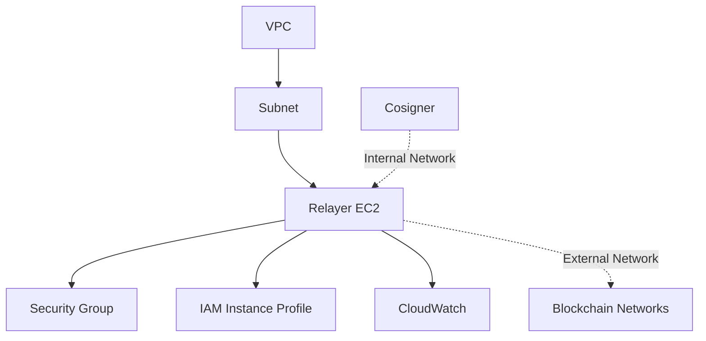

# Relayer Module Infrastructure Documentation

## Overview

The Relayer module provides a critical intermediary layer between the Fireblocks MPC cosigner and blockchain networks. This component handles message relay, protocol translation, and ensures reliable communication between isolated security domains and public blockchain infrastructure.

## Architecture

### Core Components
- **EC2 Instance**: Ubuntu-based relay server
- **Security Groups**: Network access controls for P2P and API communication
- **IAM Instance Profile**: AWS Systems Manager integration
- **Network Configuration**: Multi-protocol support (TCP/UDP)

### System Architecture
```
┌──────────────────┐         ┌──────────────────┐         ┌──────────────────┐
│   Cosigner       │ <-----> │   Relayer        │ <-----> │   RPC Node       │
│   (Internal)     │  4001   │   (Bridge)       │  P2P    │   (External)     │
└──────────────────┘         └──────────────────┘         └──────────────────┘
                                    │
                                    │ 8080
                                    ↓
                              ┌──────────────────┐
                              │   Monitoring     │
                              │   (Metrics)      │
                              └──────────────────┘
```

## EC2 Instance Configuration

### Instance Specifications
| Parameter | Value | Rationale |
|-----------|-------|-----------|
| **Instance Type** | `c5.large` | 2 vCPUs, 4 GiB RAM - Optimal for relay workloads |
| **AMI** | Ubuntu 22.04 LTS | Stable, widely-supported Linux distribution |
| **Architecture** | x86_64 | Standard architecture |
| **Instance Name** | `relayer-server-mainnet-0` | Production identifier |
| **Tenancy** | Default | Standard shared hardware |

### AMI Selection Criteria
```hcl
data "aws_ami" "ubuntu_2204" {
  most_recent = true
  owners      = ["099720109477"]  # Canonical
  
  filter {
    name   = "name"
    values = ["ubuntu/images/hvm-ssd/ubuntu-jammy-22.04-amd64-server-*"]
  }
  
  filter {
    name   = "virtualization-type"
    values = ["hvm"]
  }
  
  filter {
    name   = "architecture"
    values = ["x86_64"]
  }
  
  filter {
    name   = "root-device-type"
    values = ["ebs"]
  }
}
```

### Storage Configuration
| Component | Specification | Purpose |
|-----------|--------------|---------|
| **Root Volume** | 100 GB GP3 | OS, applications, and logs |
| **Volume Type** | GP3 | Cost-effective SSD storage |
| **IOPS** | 3000 (baseline) | Standard GP3 performance |
| **Throughput** | 125 MB/s | Default GP3 throughput |
| **Delete on Termination** | Yes | Automatic cleanup |
| **EBS Optimized** | Disabled | Not required for workload |

### Instance Configuration Details
| Parameter | Value | Purpose |
|-----------|-------|---------|
| **Source/Dest Check** | Enabled | Standard routing behavior |
| **Monitoring** | Basic | CloudWatch metrics |
| **Key Pair** | `relayer-prod` | SSH access (emergency only) |
| **IAM Instance Profile** | `AmazonSSMRoleForInstancesQuickSetup` | Systems Manager access |

## Security Group Configuration

### Security Group: `relayer-server-mainnet-sg`

#### Inbound Rules

| Port | Protocol | Source CIDR | Service | Purpose |
|------|----------|-------------|---------|---------|
| 8080 | TCP | 12.0.0.0/16 | HTTP API | RESTful API endpoint for relay operations |
| 4001 | TCP | 12.0.0.0/16 | P2P TCP | Peer-to-peer communication (reliable delivery) |
| 4001 | UDP | 12.0.0.0/16 | P2P UDP | Peer-to-peer discovery and heartbeat |
| 9009 | TCP | 12.0.0.0/16 | Metrics TCP | Prometheus/monitoring endpoint |
| 9009 | UDP | 12.0.0.0/16 | Metrics UDP | StatsD/metrics collection |

#### Outbound Rules

| Port | Protocol | Destination | Purpose |
|------|----------|------------|---------|
| All | All | 0.0.0.0/0 | Unrestricted egress for blockchain connectivity |

### Network Design Rationale

1. **Dual Protocol Support (TCP/UDP)**
   - TCP for reliable message delivery
   - UDP for low-latency discovery and heartbeat

2. **Internal Network Restriction**
   - All inbound traffic restricted to 12.0.0.0/16
   - Prevents external access to relay services
   - Ensures communication only with trusted components

3. **Monitoring Integration**
   - Dedicated ports for observability
   - Supports multiple monitoring protocols
   - Enables real-time performance tracking

## IAM Configuration

### Instance Profile
**Name**: `AmazonSSMRoleForInstancesQuickSetup`

**Purpose**: Pre-configured AWS role providing:
- Systems Manager Session Manager access
- CloudWatch Logs integration
- Parameter Store access
- Patch Manager compatibility

### Permissions Included
| Service | Permissions | Purpose |
|---------|------------|---------|
| **Systems Manager** | Session start, command execution | Remote management |
| **CloudWatch** | PutMetricData, PutLogEvents | Monitoring and logging |
| **EC2** | DescribeInstances | Instance metadata |
| **S3** | GetObject (SSM buckets) | Patch downloads |

### Security Benefits
- No custom IAM policies required
- AWS-managed policy updates
- Principle of least privilege
- No direct SSH access needed

## Terraform Variables

### Required Variables
| Variable | Type | Description | Example |
|----------|------|-------------|---------|
| `vpc_id` | string | Target VPC for deployment | `vpc-0123456789abcdef` |
| `subnet_id` | string | Subnet for EC2 instance | `subnet-0123456789abcdef` |

### Optional Variables
| Variable | Default | Description | Customization Options |
|----------|---------|-------------|----------------------|
| `aws_region` | `us-west-2` | AWS deployment region | Any AWS region |
| `ami_name_pattern` | `ubuntu/images/hvm-ssd/ubuntu-jammy-22.04-amd64-server-*` | AMI selection pattern | Custom AMI pattern |
| `ami_owner` | `099720109477` | Canonical's AWS account | Custom AMI owner |
| `internal_cidr_blocks` | `["12.0.0.0/16"]` | Internal network CIDRs | Your VPC CIDR blocks |
| `key_name` | `relayer-prod` | EC2 SSH key pair | Your key pair name |

## Deployment Architecture

### Service Dependencies


### Communication Flows

#### Inbound Message Flow
1. **Cosigner → Relayer** (Port 4001)
   - Signing requests
   - Status updates
   - Health checks

2. **Monitoring → Relayer** (Port 9009)
   - Metrics collection
   - Performance data
   - Alert queries

#### Outbound Message Flow
1. **Relayer → Blockchain RPC**
   - Transaction submission
   - Block queries
   - Network status

2. **Relayer → External Services**
   - API callbacks
   - Webhook notifications
   - External monitoring

## Operations

### Deployment Process

1. **Prerequisites Validation**
```bash
# Verify VPC and subnet
aws ec2 describe-vpcs --vpc-ids vpc-xxx
aws ec2 describe-subnets --subnet-ids subnet-xxx

# Check IAM role exists
aws iam get-instance-profile \
  --instance-profile-name AmazonSSMRoleForInstancesQuickSetup
```

2. **Terraform Deployment**
```bash
cd relayer/
terraform init
terraform plan -var-file="terraform.tfvars"
terraform apply -var-file="terraform.tfvars" -auto-approve
```

3. **Post-Deployment Verification**
```bash
# Get instance ID
INSTANCE_ID=$(terraform output -raw instance_id)

# Check instance status
aws ec2 describe-instance-status --instance-ids $INSTANCE_ID

# Connect via Session Manager
aws ssm start-session --target $INSTANCE_ID
```

### Service Configuration

#### Relay Service Setup
```bash
# Connect to instance
aws ssm start-session --target instance-id

# Install dependencies
sudo apt-get update
sudo apt-get install -y docker.io docker-compose

# Configure relay service
cat > /etc/relayer/config.yaml <<EOF
server:
  port: 8080
  host: 0.0.0.0

p2p:
  port: 4001
  protocols: [tcp, udp]

metrics:
  port: 9009
  enabled: true

upstream:
  cosigner_endpoint: "http://cosigner-internal:8080"
  rpc_endpoint: "http://rpc-node:8545"
EOF

# Start service
sudo systemctl start relayer
sudo systemctl enable relayer
```

### Monitoring

#### CloudWatch Metrics
| Metric | Description | Alert Threshold |
|--------|-------------|-----------------|
| **CPU Utilization** | Processor usage | > 80% |
| **Network In** | Incoming traffic | > 1 GB/min |
| **Network Out** | Outgoing traffic | > 1 GB/min |
| **Disk Usage** | Storage consumption | > 90% |
| **Memory Usage** | RAM utilization | > 85% |

#### Application Metrics (Port 9009)
| Metric | Type | Purpose |
|--------|------|---------|
| `relayer_messages_processed` | Counter | Total messages relayed |
| `relayer_message_latency` | Histogram | Processing time distribution |
| `relayer_active_connections` | Gauge | Current connection count |
| `relayer_errors_total` | Counter | Error occurrences |
| `relayer_queue_depth` | Gauge | Pending message count |

#### Log Management
```
/var/log/relayer/
├── access.log       # API access logs
├── error.log        # Error logs
├── p2p.log          # P2P communication logs
├── metrics.log      # Performance metrics
└── audit.log        # Security audit trail
```

### Maintenance

#### Regular Updates
```bash
# System updates
sudo apt-get update && sudo apt-get upgrade -y

# Service updates
docker pull relayer:latest
docker-compose down
docker-compose up -d
```

#### Health Checks
```bash
# Service status
curl -s http://localhost:8080/health | jq .

# P2P connectivity
nc -zv localhost 4001

# Metrics endpoint
curl -s http://localhost:9009/metrics | grep relayer_
```

#### Backup Procedures
1. **Configuration**: `/etc/relayer/` directory
2. **Logs**: Rotate and archive to S3
3. **State**: Minimal state, mostly ephemeral
4. **Credentials**: Store in Parameter Store

### Troubleshooting

#### Common Issues and Solutions

1. **Connection Timeout to Cosigner**
   ```bash
   # Check network connectivity
   nc -zv cosigner-ip 8080
   
   # Verify security groups
   aws ec2 describe-security-groups --group-ids sg-xxx
   
   # Check routing tables
   aws ec2 describe-route-tables --filters "Name=vpc-id,Values=vpc-xxx"
   ```

2. **High Memory Usage**
   ```bash
   # Check process memory
   ps aux | sort -nrk 4 | head
   
   # Analyze memory usage
   free -h
   vmstat 1 5
   
   # Restart service if needed
   sudo systemctl restart relayer
   ```

3. **Message Queue Buildup**
   ```bash
   # Check queue status
   curl http://localhost:8080/api/queue/status
   
   # Increase worker threads
   sed -i 's/workers: 10/workers: 20/' /etc/relayer/config.yaml
   sudo systemctl restart relayer
   ```

4. **Network Performance Issues**
   ```bash
   # Test bandwidth
   iperf3 -c target-host -p 4001
   
   # Check packet loss
   mtr -r -c 100 target-host
   
   # Analyze network usage
   nethogs -d 1
   ```

## Security Considerations

### Network Security
1. **Ingress Restrictions**
   - All ports restricted to internal CIDR
   - No direct internet exposure
   - Stateful security group rules

2. **Egress Requirements**
   - Unrestricted for blockchain connectivity
   - Consider egress filtering for production
   - Monitor unusual outbound patterns

### Access Control
1. **No Direct SSH**
   - Session Manager only
   - Audit trail in CloudTrail
   - MFA enforcement possible

2. **Service Authentication**
   - Internal services use private IPs
   - Consider mTLS for service-to-service
   - API key rotation schedule

### Data Protection
1. **Encryption in Transit**
   - TLS for API endpoints
   - Consider VPN for sensitive data
   - Certificate management

2. **Logging Security**
   - Encrypt logs at rest
   - Restrict log access
   - Regular log rotation

## Performance Optimization

### Instance Optimization
| Aspect | Current | Optimization |
|--------|---------|-------------|
| **Instance Type** | c5.large | Consider c5n.large for network-intensive workloads |
| **EBS Optimized** | Disabled | Enable for consistent I/O performance |
| **Placement Group** | None | Use cluster placement for low latency |
| **Enhanced Networking** | Default | Enable SR-IOV for better performance |

### Network Optimization
1. **Connection Pooling**
   - Maintain persistent connections
   - Configure appropriate pool sizes
   - Monitor connection reuse

2. **Message Batching**
   - Batch small messages
   - Compress large payloads
   - Optimize serialization format

3. **Caching Strategy**
   - Cache frequently accessed data
   - Implement TTL policies
   - Monitor cache hit rates

## Cost Analysis

### Monthly Cost Breakdown
| Component | Specification | Estimated Cost |
|-----------|--------------|----------------|
| EC2 Instance | c5.large (730 hours) | $62.00 |
| EBS Storage | 100 GB GP3 | $8.00 |
| Data Transfer | 1 TB outbound | $90.00 |
| CloudWatch | Logs and metrics | $5.00 |
| **Total** | | **~$165.00** |

### Cost Optimization Strategies
1. **Reserved Instances**: 40-60% savings with 1-3 year commitment
2. **Spot Instances**: For non-critical/development environments
3. **Data Transfer**: Use VPC endpoints for AWS services
4. **Right-sizing**: Monitor actual usage and adjust instance type

## Disaster Recovery

### Recovery Strategy
| Scenario | RTO | RPO | Recovery Method |
|----------|-----|-----|-----------------|
| **Instance Failure** | 5 min | 0 | Auto-recovery or manual restart |
| **AZ Failure** | 15 min | 5 min | Multi-AZ deployment |
| **Region Failure** | 1 hour | 30 min | Cross-region failover |
| **Data Corruption** | 30 min | 1 hour | Restore from backups |

### Backup Strategy
1. **Configuration**: Version controlled in Git
2. **Logs**: Streamed to S3 with lifecycle policies
3. **State**: Minimal state, quick reconstruction
4. **Monitoring**: Export dashboards and alerts

### High Availability Setup
```hcl
# Multi-instance deployment for HA
resource "aws_instance" "relayer-servers" {
  count = 2
  
  # Spread across AZs
  subnet_id = element(var.subnet_ids, count.index)
  
  # Use load balancer for distribution
  # Configure health checks
  # Implement failover logic
}
```

## Integration Points

### Upstream Services (Cosigner)
- **Protocol**: HTTP/gRPC
- **Port**: 8080/50051
- **Authentication**: Internal network trust
- **Retry Logic**: Exponential backoff
- **Circuit Breaker**: Implemented

### Downstream Services (RPC)
- **Protocol**: JSON-RPC/WebSocket
- **Port**: 8545/8546
- **Authentication**: API keys
- **Load Balancing**: Round-robin
- **Failover**: Automatic to backup nodes

### Monitoring Integration
- **Prometheus**: Metrics scraping
- **Grafana**: Dashboard visualization
- **AlertManager**: Alert routing
- **PagerDuty**: Incident management

## Compliance and Audit

### Audit Requirements
1. **Access Logging**: All API calls logged
2. **Change Tracking**: Configuration changes tracked
3. **Session Recording**: SSM sessions recorded
4. **Data Retention**: 90 days minimum

### Compliance Controls
| Control | Implementation | Verification |
|---------|---------------|--------------|
| **Access Control** | IAM + Security Groups | AWS Config Rules |
| **Encryption** | TLS in transit | Certificate validation |
| **Monitoring** | CloudWatch + Application logs | Log analysis |
| **Incident Response** | Runbooks + Automation | Regular drills |

---

*Module Version: 1.0*  
*Last Updated: 2025*  
*Terraform Version: >= 0.12*  
*AWS Provider Version: ~> 5.0*